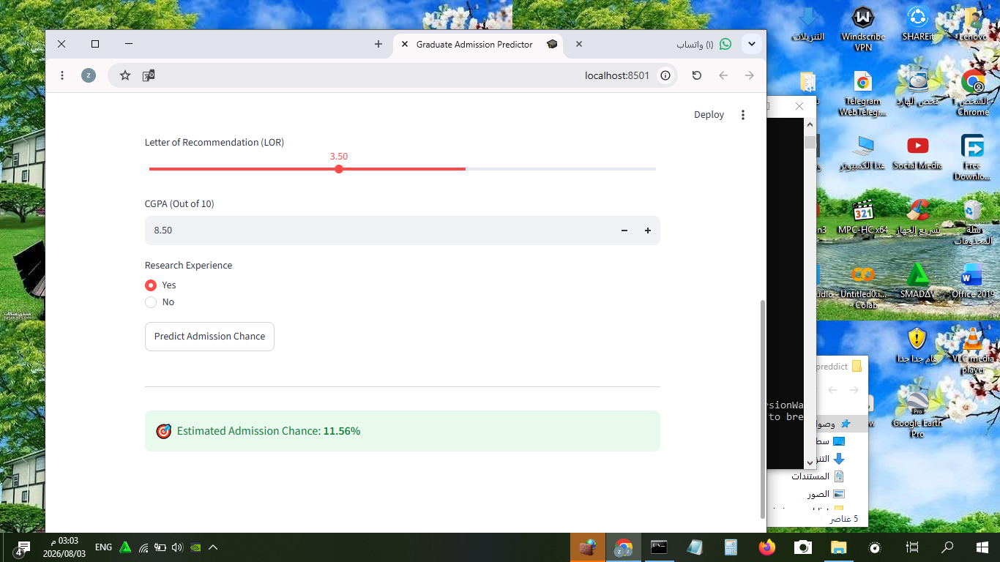

# Linear Regression Model Prediction

## 📌 Description
This project implements a Linear Regression model to predict values and compares the **Actual Values** against the **Predicted Values** using side-by-side histograms for clear data visualization.

---

## 📊 Features
* Trains a regression model on test data.
* Evaluates performance by comparing real vs. predicted outputs.
* Visualizes data distributions using `Matplotlib`.
---

## 🛠️ Technologies Used
* **Python**
* **Matplotlib** (for data visualization)
* **Scikit-Learn** (or relevant ML library)

---

## 📈 Code Snippet (Visualization)
Here is how the side-by-side distribution plots are generated:

```python
import matplotlib.pyplot as plt

# Create subplots side by side
plt.figure(figsize=(10, 4))

# Actual Values Plot
plt.subplot(1, 2, 1)
plt.hist(y_test, color='blue', alpha=0.7)
plt.title('Actual Values')
plt.xlabel('Value')
plt.ylabel('Frequency')

# Predicted Values Plot
plt.subplot(1, 2, 2)
plt.hist(lin_pred, color='orange', alpha=0.7)
plt.title('Predicted Values')
plt.xlabel('Value')
plt.ylabel('Frequency')

plt.tight_layout()
plt.show()
##App preview

